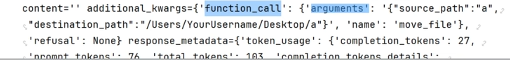
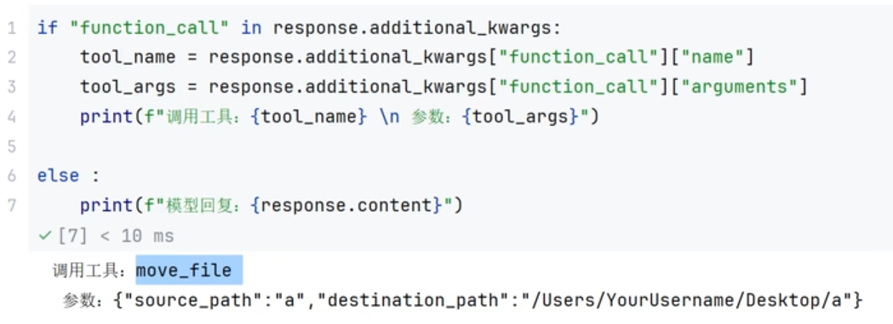
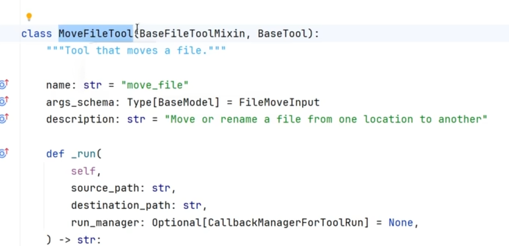
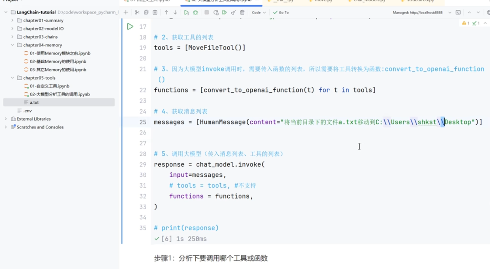
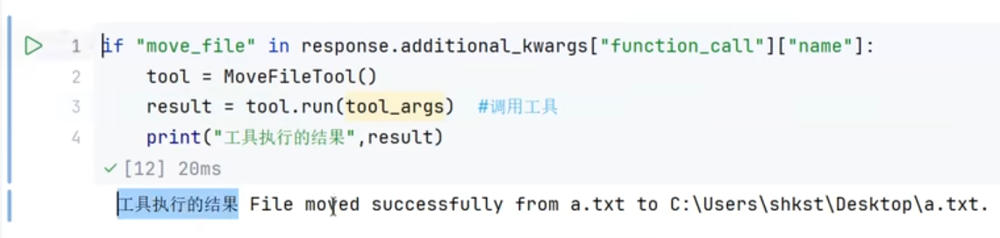

大模型的回复没有具体的content，而是回复了additional_kwargs 作为函数调用的指示，此时大模型的任务完成了，告知了我们的自己代码或者说框架代码具体调用哪个函数，并且函数参数是什么

函数代码判断是否执行工具

如果代码发现当前要调用的工具就叫做move_file

那么此时我们函数代码可以直接调用函数MoveFileTool具体执行具体函数就行了，此时就是调用工具的流程了

这是具体调用工具的代码，路径上面要加转义字符，否则\n就成了换行了

于是就移动到了桌面上

这种属于函数式调用，后续MCP作为替代出现

这个工具是我们自己调用的，agent可以自动调用

